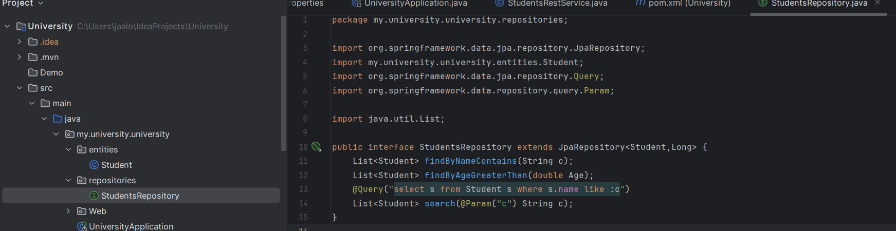
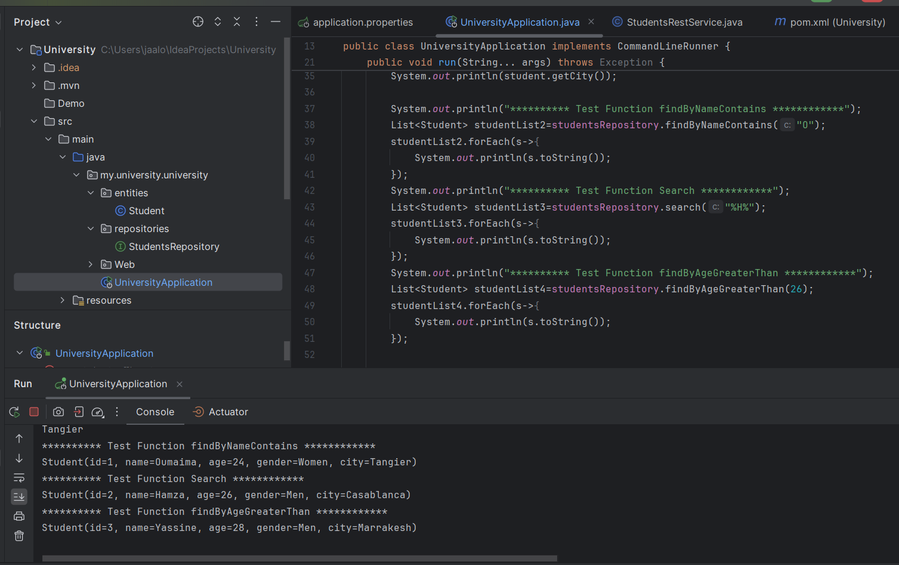

<h4>The aim of this simple tutorial is to create a Spring Initializer project with JPA, H2, Spring Web and Lombock dependencies, to create JPA entities, to configure the persistence unit in the application.properties file, to create the JPA Repository interface based on Spring data and to test some data management operations. </h4>

